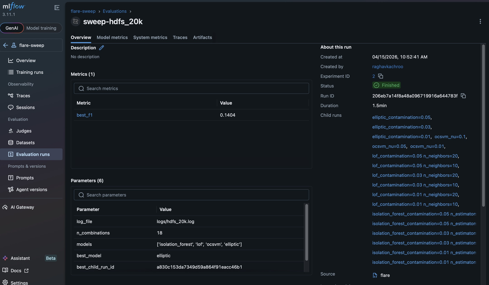
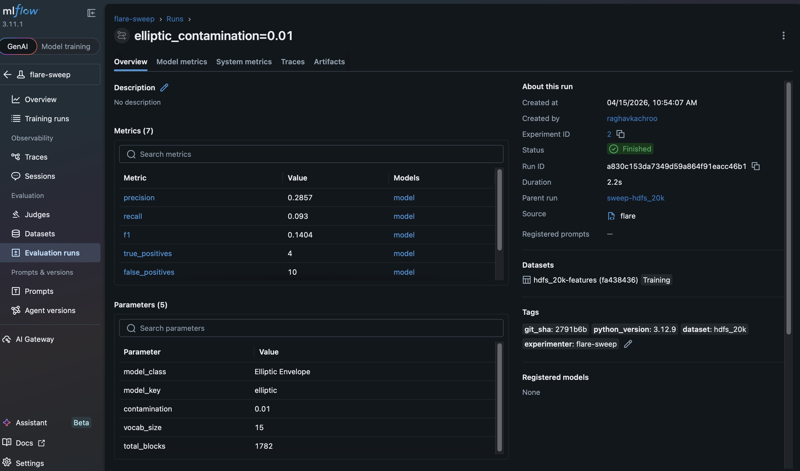
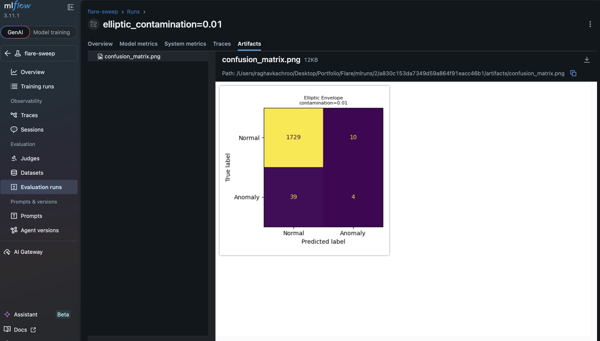

# Flare

**LLM-powered log anomaly detection and incident summarization**

> [Read the blog post: Building Flare](https://mister-raggs.github.io/ai/building-flare-llm-powered-incident-detection/)

Flare ingests raw log data, detects anomalies using classical ML (Isolation Forest, LOF, One-Class SVM), clusters related signals into incidents, and summarizes each in plain English with severity assessment and remediation steps — all accessible via a REST API and dark-themed dashboard. Every run is tracked in MLflow with full experiment comparison, model registry, and dataset lineage.

## Quickstart

```bash
git clone https://github.com/mister-raggs/flare
cd flare
cp .env.example .env   # add your Anthropic API key
docker-compose up
# open http://localhost:8000/dashboard
```

Paste logs into the dashboard or hit the API directly at `http://localhost:8000/docs`.

> **Live demo:** [`http://167.172.216.126:8000/docs`](http://167.172.216.126:8000/docs) — [`http://167.172.216.126:8000/dashboard`](http://167.172.216.126:8000/dashboard)

> **Without Docker:** `pip install -e ".[all]"` then `uvicorn flare.api.main:app --reload`

## Why Flare?

On-call engineers drown in log volume during incidents. Keyword-based alerting either misses subtle anomalies or floods you with false positives. Flare takes a different approach: it uses statistical ML to identify *which* log blocks are anomalous, then uses an LLM to explain *why* in terms an engineer can act on. The result is a system that doesn't just detect — it triages, explains, and suggests next steps, with an eval harness that scores its own output.

## Dashboard

```
┌─────────────────────────────────────────────────────────────────────────┐
│  Flare                                                   v0.1.0  ● ok │
├─────────────────────────────────────────────────────────────────────────┤
│  ┌─────────────────────────────────────────────────────────────────┐   │
│  │ Paste log lines here...                                        │   │
│  └─────────────────────────────────────────────────────────────────┘   │
│  [ Analyze Logs ]  [ Upload .log ]  ☐ Run quality eval                │
├──────────────────────┬──────────────────────────────────────────────────┤
│  INCIDENTS (3)       │  INCIDENT DETAIL                                │
│                      │                                                 │
│  ┌────────────────┐  │  Severity  Anomaly Score  Confidence            │
│  │ ■ HIGH   Inc 0 │◄─│  ┌──────┐ ┌──────────┐   ┌─────────┐          │
│  │ 1 block        │  │  │ HIGH │ │ -0.2310  │   │   85%   │          │
│  │ 5 log lines    │  │  └──────┘ └──────────┘   └─────────┘          │
│  └────────────────┘  │                                                 │
│  ┌────────────────┐  │  EXPLANATION                                    │
│  │ ■ MED   Inc 1  │  │  Block transfer failed due to connection        │
│  │ 1 block        │  │  reset. The DataXceiver thread encountered      │
│  │ 3 log lines    │  │  IOException while receiving block data...      │
│  └────────────────┘  │                                                 │
│  ┌────────────────┐  │  ROOT CAUSE                                     │
│  │ ■ MED   Inc 2  │  │  Network instability on the remote DataNode     │
│  │ 1 block        │  │  caused TCP connection reset during transfer.   │
│  │ 4 log lines    │  │                                                 │
│  └────────────────┘  │  REMEDIATION                                    │
│                      │  [immediate] Check network connectivity         │
│                      │  [immediate] Verify block replication factor    │
│                      │  [short-term] Review DataNode heap/threads      │
│                      │                                                 │
│                      │  ▸ Show 5 raw log lines                         │
├──────────────────────┴──────────────────────────────────────────────────┤
│ Incidents: 3  Critical: 0  High: 1  Medium: 2  Low: 0   42ms  $0.004 │
└─────────────────────────────────────────────────────────────────────────┘
```

## Architecture

```
                    ┌────────────────────────────────────────────────┐
                    │                    Flare                       │
                    ├────────────────────────────────────────────────┤
                    │                                                │
  Raw Logs ──────►  │  ingestion/     Multi-format parsing (HDFS,    │
  (text/file/       │       │         syslog, OpenSSH, generic)      │
   live replay)     │       │         + Drain3 template mining       │
                    │       ▼                                        │
                    │  detection/     Isolation Forest / LOF /        │
                    │       │         One-Class SVM anomaly scoring   │
                    │       ▼                                        │
                    │  clustering/    Incident grouping + enrichment  │
                    │       │                                        │
                    │       ▼                                        │
                    │  llm/           Claude Sonnet summarization     │
                    │       │         + LLM-as-judge quality eval     │
                    │       ▼                                        │
                    │  eval/          Precision / Recall / F1         │
                    │                 + LLM quality rubric            │
                    ├────────────────────────────────────────────────┤
                    │  experiment/    MLflow: hyperparameter sweeps,  │
                    │                 nested runs, model registry     │
                    ├────────────────────────────────────────────────┤
                    │  replay/        Live log replay + windowed      │
                    │                 real-time anomaly detection     │
                    ├────────────────────────────────────────────────┤
                    │  api/           FastAPI REST layer              │
                    │  ├─ POST /detect     ← log text → incidents    │
                    │  ├─ POST /summarize  ← incidents → summaries   │
                    │  ├─ POST /analyze    ← log text → everything   │
                    │  └─ GET /health      ← status check            │
                    │                                                │
                    │  dashboard/     Single-file HTML + vanilla JS   │
                    │  cli/           Click + Rich CLI                │
                    └────────────────────────────────────────────────┘
```

## Pipeline

1. **Ingestion** — Parse raw HDFS logs with regex, apply [Drain3](https://github.com/logpai/Drain3) template mining to extract parameterized log templates
2. **Detection** — Build per-block feature vectors from template frequency distributions, run Isolation Forest to score anomalies
3. **Clustering** — Group anomalous blocks into incidents using DBSCAN on normalized feature vectors, enrich with log lines, templates, and time ranges
4. **LLM Summarization** — Send each incident to Claude Sonnet for plain-English explanation, severity assessment, root cause analysis, and remediation steps
5. **Evaluation** — Classical: precision/recall/F1 against ground truth. LLM: quality rubric scoring (relevance, specificity, actionability) via LLM-as-judge, plus cost/latency tracking

## API Reference

All endpoints are documented with examples at `http://localhost:8000/docs` (Swagger UI).

| Method | Endpoint | Description |
|--------|----------|-------------|
| `POST` | `/detect` | Parse logs + detect anomalies + cluster incidents |
| `POST` | `/detect/upload` | Same, but accepts a file upload |
| `POST` | `/summarize` | LLM summarization of detected incidents |
| `POST` | `/analyze` | End-to-end: detect + summarize in one call |
| `GET`  | `/health` | API status, Anthropic connectivity, version |

### Example: Full pipeline

```bash
curl -X POST http://localhost:8000/analyze \
  -H "Content-Type: application/json" \
  -d '{"log_text": "<paste logs here>", "run_eval": false}'
```

## Benchmark Results

### Classical Detection — HDFS Dataset (LogHub)

Evaluated on the full public [HDFS log dataset](https://github.com/logpai/loghub) — 11.2M lines, 575,061 blocks, 16,838 anomalies (2.9% anomaly rate).

| Method           | Precision | Recall | F1    | TP     | FP    | FN    | Notes                   |
|------------------|-----------|--------|-------|--------|-------|-------|-------------------------|
| Isolation Forest | 0.688     | 0.601  | 0.642 | 10,119 | 4,590 | 6,719 | contamination=0.029     |

Features: per-block Drain3 template frequency vectors (47 templates learned across full dataset). Detection degrades on small slices (<50K blocks) due to insufficient template diversity — the model needs enough blocks to learn a meaningful normal distribution.

<details>
<summary>Micro-sample (86 lines, 18 blocks) — for unit test reference only</summary>

| Method           | Precision | Recall | F1    | Notes                |
|------------------|-----------|--------|-------|----------------------|
| Isolation Forest | 1.0000    | 1.0000 | 1.000 | contamination=0.15   |

</details>

### End-to-End Latency

| Stage | Time | Notes |
|-------|------|-------|
| Ingestion + Detection + Clustering | ~40ms | CPU-bound, no API calls |
| LLM Summarization (per incident) | ~1-3s | Claude Sonnet, temp=0.0 |
| Full pipeline (detect + summarize) | ~4-10s | Depends on incident count |

### LLM Quality Evaluation

Scored via LLM-as-judge (Claude Sonnet evaluating its own output on a 1–5 rubric). Run on the HDFS sample — 1 incident, 663 input / 380 output tokens, $0.0077.

| Metric          | Score | Notes                                                   |
|-----------------|-------|---------------------------------------------------------|
| Relevance       | 5/5   | Does the explanation match the log evidence?            |
| Specificity     | 5/5   | Is it specific to this incident, not generic?           |
| Actionability   | 4/5   | Are remediation steps concrete and useful?              |
| **Mean Quality**| **4.67/5** | Aggregate across all three dimensions              |

> Scores are generated by LLM-as-judge — see [the blog post](https://mister-raggs.github.io/ai/building-flare-llm-powered-incident-detection/) for methodology. Run your own eval with `flare summarize --input results.json --eval`.

## MLflow Experiment Tracking

Flare tracks every detection run, hyperparameter sweep, and LLM evaluation in MLflow — params, metrics, tags, dataset lineage, model signatures, and artifacts.

### Hyperparameter sweep — cross-model comparison

`flare model sweep` runs a grid search across model families, logging each combination as a **nested child run** under a single parent. The parent is annotated with the best F1 found across all children.

**Parent run** — 18 child runs (4 models × param grid), best outcome annotated:



**Best child run** — tags (git SHA, Python version, dataset), dataset lineage, and all eval metrics:



**Artifacts tab** — confusion matrix logged per child run with `mlflow.log_figure()`:



### What gets tracked

| MLflow concept | What Flare logs |
|---|---|
| **Params** | contamination, n_estimators, vocab_size, model_class, total_blocks |
| **Metrics** | precision, recall, F1, true/false positives, anomaly_rate |
| **Tags** | git_sha, python_version, dataset, experimenter |
| **Dataset lineage** | `mlflow.log_input()` — feature matrix source and shape |
| **Model signature** | `infer_signature()` — input/output schema in registry |
| **Artifacts** | sklearn model, vocab.json, confusion_matrix.png |
| **Nested runs** | Sweep parent → N children (one per model × params combo) |
| **LLM eval runs** | mean_relevance, mean_specificity, mean_actionability, total_cost_usd |

### CLI

```bash
# Compare four anomaly detection models with a grid search
flare model sweep \
  -i logs/hdfs_20k.log \
  --labels logs/hdfs_20k_labels.csv \
  --models isolation_forest,lof,ocsvm,elliptic \
  --promote          # promote best model to Staging

# List all registered model versions and stages
flare model list

# Compare recent detection runs side-by-side
flare model compare --n 10

# Promote a specific version to Production
flare model promote 3 Production
```

Start the MLflow UI to explore runs interactively:

```bash
mlflow ui --port 5000
# open http://localhost:5000 → experiment: flare-sweep
```

## Project Structure

```
flare/
├── ingestion/        # Log parsing, Drain3 templating, structured events
│   ├── formats.py    # Built-in format registry (HDFS, syslog, OpenSSH) + auto-detect
│   ├── models.py     # LogEvent, ParsedLogBatch data models
│   └── parser.py     # LogParser: multi-format + generic heuristic fallback
├── detection/        # Classical anomaly detection
│   └── detector.py   # Isolation Forest on template frequency features + MLflow tracking
├── clustering/       # Incident grouping
│   └── clusterer.py  # Incident clustering + enrichment with log context
├── experiment/       # MLflow experiment utilities
│   └── sweep.py      # HyperparamSweep: nested runs across model families
├── replay/           # Live log replay
│   ├── replayer.py   # Windowed real-time detection (LogReplayer)
│   └── shuffler.py   # Anomaly injection for synthetic demo data
├── eval/             # Benchmark framework
│   └── benchmark.py  # Classical metrics + LLM quality rubric + MLflow logging
├── llm/              # LLM-assisted summarization
│   ├── client.py     # Anthropic API client with retry, rate limiting & timeout
│   ├── prompts.py    # All prompt templates
│   ├── schemas.py    # Pydantic models: LLMSummary, QualityScore, etc.
│   └── summarizer.py # Incident → LLMSummary pipeline
├── api/              # FastAPI REST layer
│   ├── main.py       # App, lifespan, CORS, exception handling
│   ├── models.py     # Pydantic request/response models
│   ├── deps.py       # Shared settings & dependencies
│   └── routes/       # Endpoint handlers
│       ├── health.py
│       ├── detect.py
│       ├── summarize.py
│       └── demo.py   # SSE streaming live demo endpoint
├── cli/              # CLI entrypoint
│   └── main.py       # detect / summarize / collect / model sweep/list/promote/compare
dashboard/
└── index.html        # Single-file dark-themed dashboard (no build step)
```

## Development

```bash
# Install with all dependencies
pip install -e ".[all]"

# Run tests (134 tests, no API calls — LLM tests use mocks)
pytest

# Run linter
ruff check flare/ tests/

# Type check
mypy flare/ --ignore-missing-imports

# Run API locally (with hot reload)
uvicorn flare.api.main:app --reload

# Run with Docker
docker-compose up --build
```

## Limitations & Future Work

- **Bag-of-templates features.** Detection uses template frequency histograms — it doesn't capture temporal patterns (event ordering, time deltas between templates) that would catch slow-burn anomalies. A cross-model sweep on the 20k HDFS dataset returned F1 < 0.15 across Isolation Forest, LOF, One-Class SVM, and Elliptic Envelope, confirming the bottleneck is the feature space, not the algorithm. Adding bigram transition counts and inter-arrival time variance is the next planned improvement.
- **Incident clustering.** Grouping anomalous blocks by feature similarity is a rough heuristic. A vector store with log sequence embeddings would capture semantic similarity and enable "show me similar past incidents."
- **LLM-as-judge calibration.** The quality eval rubric hasn't been calibrated against human scores. A golden dataset of 50-100 human-evaluated explanations would quantify judge accuracy.
- **Static pipeline.** A production version would consume from Fluent Bit or an OTEL collector, maintain persistent template state across restarts, and push summaries to PagerDuty or Slack.

## Tech Stack

| Component        | Tool                                      |
|------------------|-------------------------------------------|
| Log parsing      | Drain3                                    |
| ML detection     | scikit-learn (Isolation Forest, LOF, OCSVM, DBSCAN) |
| LLM              | Anthropic Claude Sonnet via `anthropic`   |
| Data validation  | Pydantic                                  |
| API              | FastAPI + Uvicorn                         |
| Dashboard        | Vanilla HTML/CSS/JS (no build step)       |
| CLI              | Click + Rich                              |
| Experiment tracking | MLflow (runs, registry, nested sweeps) |
| Testing          | pytest (134 tests, all mocked for CI)     |
| Linting          | ruff                                      |
| CI               | GitHub Actions                            |
| Deployment       | Docker + docker-compose                   |

## License

MIT
